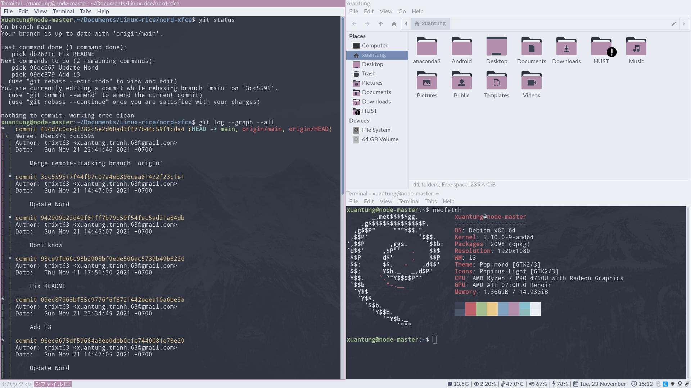
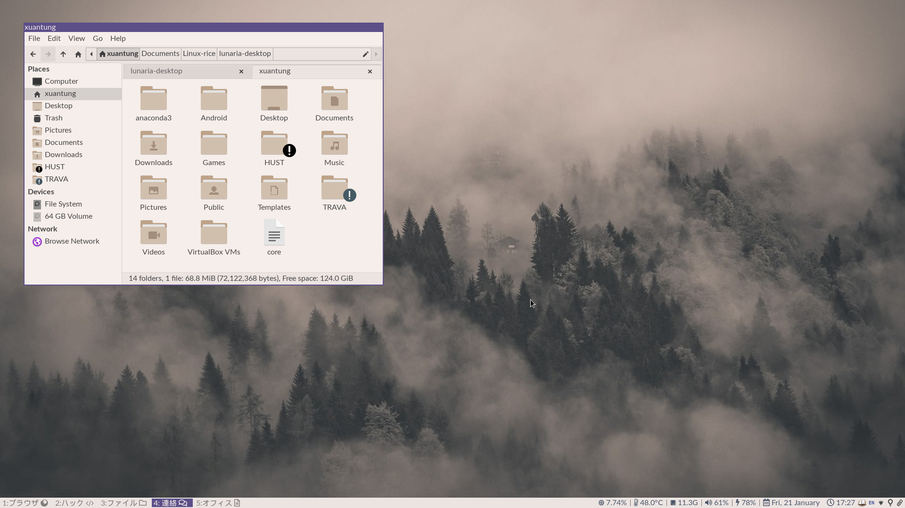
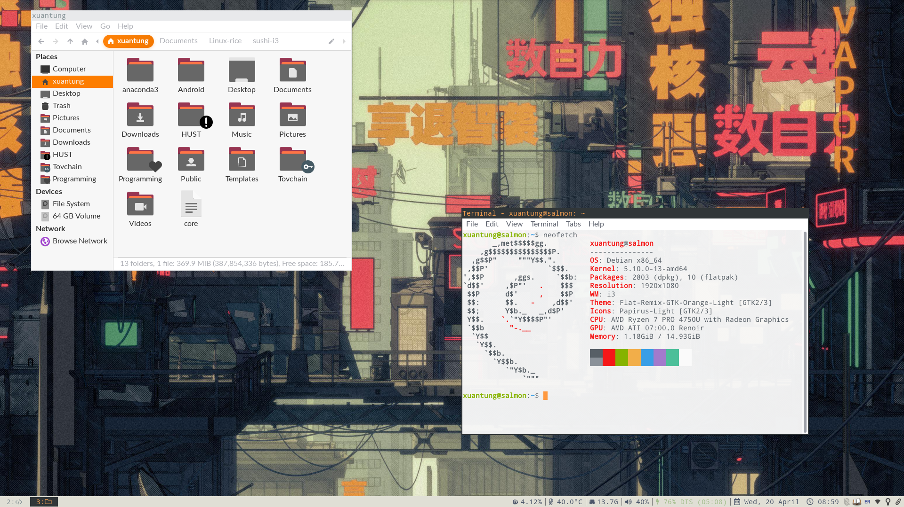
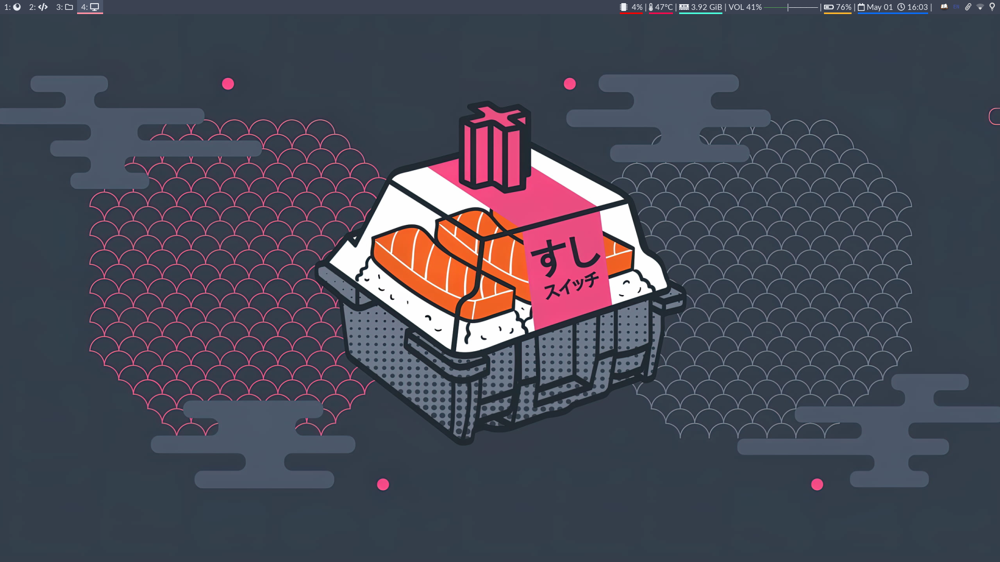
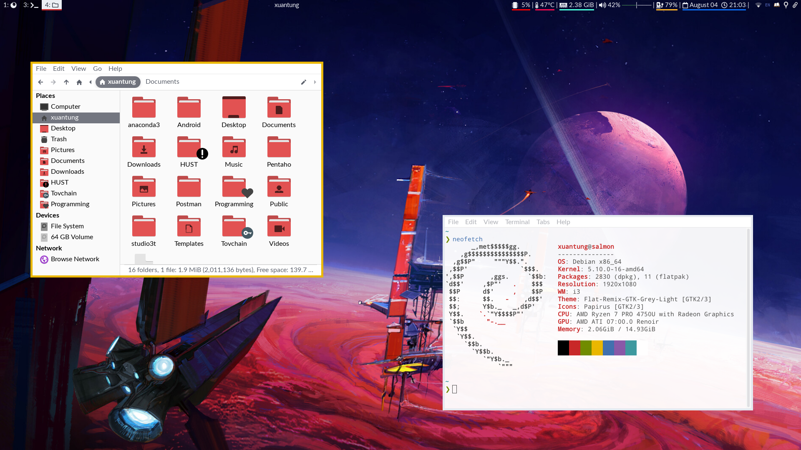
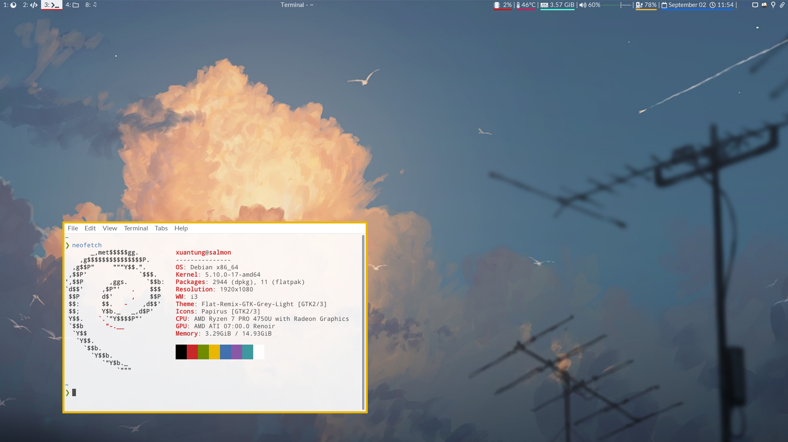

# User interface customization for i3wm 

- There are currently 4 themes:
	- Nord light.
	- Lunaria light.
	- Sushi.
	- Nord with Pink salmon.

## Presiquities

- Install the following packages:

	- **feh**: setting background images.
	- **[Gogh](https://gogh-co.github.io/Gogh/)**: to change terminal theme.
	- **lxappearance**: setting the fonts, and the gtk themes.
	- **brightnessctl**: controlling the brightness keys.
	- **Polybar**: i3blocks alternative. Looks much nicer, also support customization better.
	- **rofi**: dmenu alternative. You should install [rofi themes by adi1090x](https://github.com/adi1090x/rofi) first.
	- **[maestrogerardo's i3-gaps-deb](https://github.com/maestrogerardo/i3-gaps-deb)**: Debian does not support i3-gaps. Use this repo to setup i3-gaps for your Debian machine.
	- **[Papirus Folders](https://github.com/PapirusDevelopmentTeam/papirus-folders)** as well as **[Papirus Nord](https://github.com/Adapta-Projects/Papirus-Nord)**: for icons themes. You can use whatever icons set you want though.

## Folders

- Put the contents of `backgrounds` and `themes` into the respective folders in `~/.local/share/`.
- Put the contents of `i3`, `rofi` and `polybar` into the repective folders in `~/.config/`.

## Existing customizations 

### 1. Nord 
- Theme: Pop nord.
- Icons: Papirus nord purple.
- Gogh terminal: Nordic light.


### 2. Lunaria


### 3. Sushi
- Theme: Flat-Remix-GTK-Black (or Orange).
- Icons: Papirus yaru.
- Terminal: Ayu Light.
- Wallpaper: ```backgrounds/sushi/sushi.jpg```


### 4. Nord w/ Pink salmon
- 


### 5. Space red


Space Light



